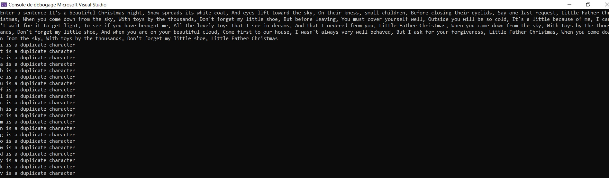

# PrintDuplicateChars

Exercise on datastructure found on the following web site [www.csharpstar.com](https://www.csharpstar.com/csharp-algorithms/)

# Goal #

The goal was to find in a string all characters which are duplicate

## Approach ##

* First, a check is performed to ensure a data has been selected by the user.
* Then, a function modifies the string by changing all uppercase to lowercase and by removing all punctuation (all characters not belonging to the interval 97 to 122, both included).
* Finaly, a for loop is used to run over the modified string and to check if a letter is a duplicate or not. A dictionary is used to access data already stored and to increment the value or to add a new pair of key/value if the letter was not present.

